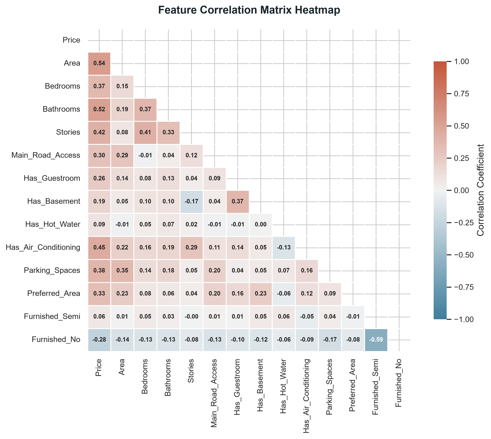
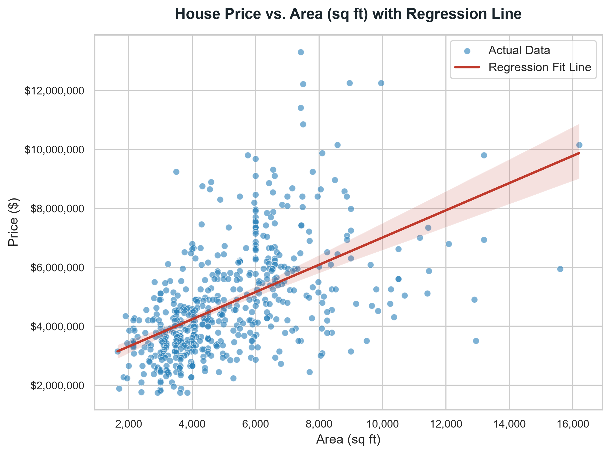
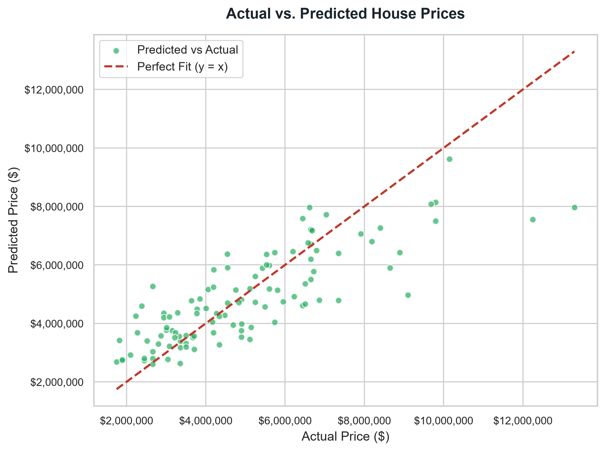
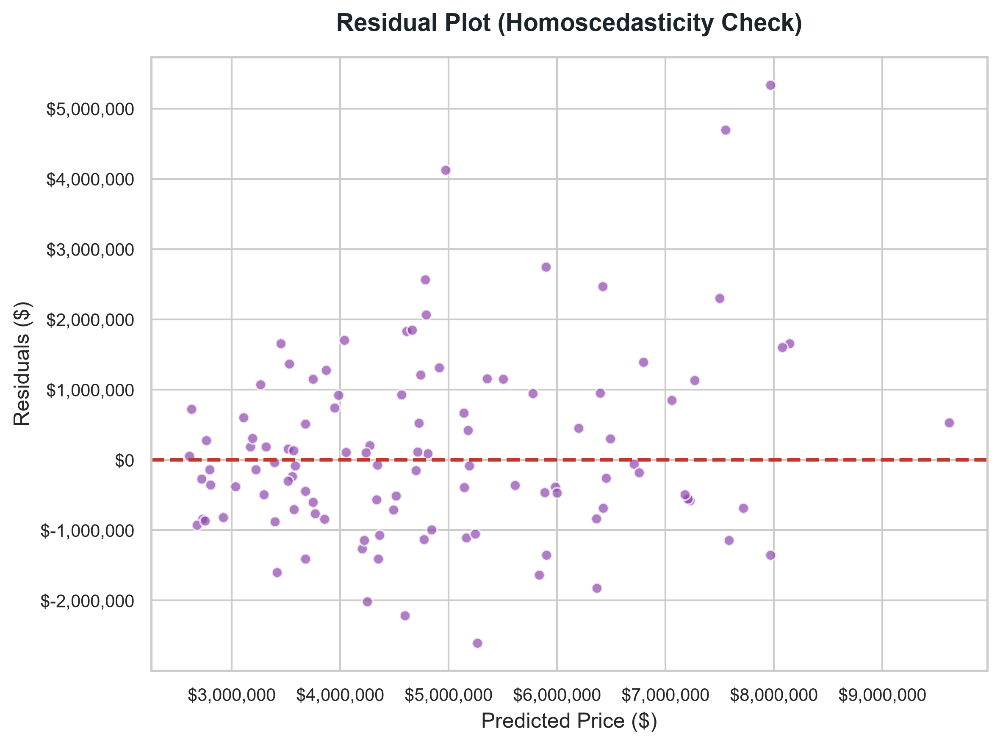
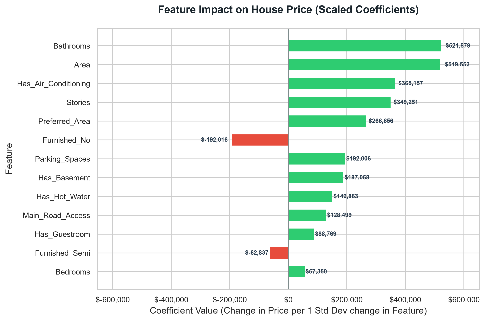

# Task-03-Linear-Regression

## Overview
This project implements a Multiple Linear Regression model from scratch using `scikit-learn` to predict housing prices. It features data cleaning, categorical feature encoding, standard feature scaling, model fitting, and comprehensive diagnostic evaluations.

## Objective
To build, evaluate, and interpret a linear regression model that predicts house price based on property characteristics, identifying the most significant drivers of housing valuation.

## Dataset
The model is trained on the real `Housing.csv` dataset, which contains 545 samples and the following features:
- **Numerical**: `area`, `bedrooms`, `bathrooms`, `stories`, `parking`, `price` (Target).
- **Categorical/Binary**: `mainroad`, `guestroom`, `basement`, `hotwaterheating`, `airconditioning`, `prefarea`, `furnishingstatus`.

## Tools Used
- **Language**: Python 3.11
- **Libraries**: pandas, numpy, scikit-learn, matplotlib, seaborn

## Workflow
1. **Load Data**: Import raw dataset (`dataset/Housing.csv`).
2. **Preprocessing**: Map yes/no categories to 1/0 and dummy-encode `furnishingstatus`. Rename columns to Title Case.
3. **Split Data**: Train-test split (80% training, 20% testing).
4. **Feature Scaling**: Fit and apply `StandardScaler` to independent variables.
5. **Model Fit**: Train a multiple `LinearRegression` model.
6. **Evaluation**: Calculate MAE, MSE, RMSE, and $R^2$ scores on train/test sets.
7. **Visualization**: Save diagnostic plots (`images/*.png`) and predictions.

## Project Structure
```text
Task-03-Linear-Regression/
│
├── dataset/
│   └── Housing.csv
│
├── notebooks/
│   └── linear_regression.ipynb
│
├── images/
│   ├── dataset_preview.png
│   ├── correlation_heatmap.png
│   ├── regression_line.png
│   ├── actual_vs_predicted.png
│   ├── residual_plot.png
│   └── feature_importance.png
│
├── models/
│   └── linear_regression_model.pkl
│
├── outputs/
│   ├── predictions.csv
│   └── evaluation_metrics.txt
│
├── linear_regression.py
├── requirements.txt
├── README.md
├── LICENSE
└── .gitignore
```

## Model Evaluation
The model achieved the following performance metrics:
* **Train $R^2$ Score**: `0.6859`
* **Test $R^2$ Score**: `0.6529`
* **Test MAE**: `$970,043`
* **Test RMSE**: `$1,324,507`

### Key Visualizations
* **Correlation Heatmap & Area Regression Fit**:
  
  

* **Actual vs. Predicted Prices & Residuals**:
  
  

* **Feature Coefficients (Scaled)**:
  

## Outputs
- `models/linear_regression_model.pkl`: Pickle file storing model coefficients, scaler object, and feature names.
- `outputs/predictions.csv`: Table containing actual test values, predictions, and residual errors.
- `outputs/evaluation_metrics.txt`: Summarized metrics text file.
- `images/`: High-resolution figures of model performance and data features.

## How to Run
1. Install dependencies:
   ```bash
   pip install -r requirements.txt
   ```
2. Run the main pipeline script:
   ```bash
   python linear_regression.py
   ```
3. Run the Jupyter Notebook to view interactive step-by-step analysis:
   ```bash
   jupyter notebook notebooks/linear_regression.ipynb
   ```

## Author
Jaya Sri Vardhan Samgoju
